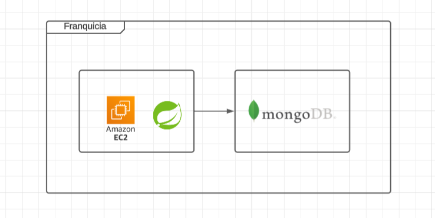

# Proyecto Franquicias Implementando Clean Architecture

## Antes de Iniciar

Empezaremos por explicar los diferentes componentes del proyectos y partiremos de los componentes externos, continuando con los componentes core de negocio (dominio) y por último el inicio y configuración de la aplicación.

Lee el artículo [Clean Architecture — Aislando los detalles](https://medium.com/bancolombia-tech/clean-architecture-aislando-los-detalles-4f9530f35d7a)

# Arquitectura


## Domain

Es el módulo más interno de la arquitectura, pertenece a la capa del dominio y encapsula la lógica y reglas del negocio mediante modelos y entidades del dominio.

## Usecases

Este módulo gradle perteneciente a la capa del dominio, implementa los casos de uso del sistema, define lógica de aplicación y reacciona a las invocaciones desde el módulo de entry points, orquestando los flujos hacia el módulo de entities.

## Infrastructure

### Helpers

En el apartado de helpers tendremos utilidades generales para los Driven Adapters y Entry Points.

Estas utilidades no están arraigadas a objetos concretos, se realiza el uso de generics para modelar comportamientos
genéricos de los diferentes objetos de persistencia que puedan existir, este tipo de implementaciones se realizan
basadas en el patrón de diseño.

Estas clases no puede existir solas y debe heredarse su compartimiento en los **Driven Adapters**

### Driven Adapters

Los driven adapter representan implementaciones externas a nuestro sistema, como lo son conexiones a servicios rest,
soap, bases de datos, lectura de archivos planos, y en concreto cualquier origen y fuente de datos con la que debamos
interactuar.

### Entry Points

Los entry points representan los puntos de entrada de la aplicación o el inicio de los flujos de negocio.

## Application

Este módulo es el más externo de la arquitectura, es el encargado de ensamblar los distintos módulos, resolver las dependencias y crear los beans de los casos de use (UseCases) de forma automática, inyectando en éstos instancias concretas de las dependencias declaradas. Además inicia la aplicación (es el único módulo del proyecto donde encontraremos la función “public static void main(String[] args)”.

**Los beans de los casos de uso se disponibilizan automaticamente gracias a un '@ComponentScan' ubicado en esta capa.**

# Arquitectura del proyecto

Este proyecto está desplegado en AWS utilizando una instancia EC2  y se conecta a un cluster de MongoDB Atlas.

## Diagrama de despliegue


## Descripción

- **EC2 Instance:** Máquina virtual de AWS donde corre la aplicación.
- **Spring Boot:** La aplicación Java que expone la API REST.
- **MongoDB Atlas:** Cluster de base de datos en la nube al que se conecta la aplicación.


## Configuración y Variables de Entorno

El proyecto utiliza varias propiedades y variables de configuración definidas en `application.yml` que controlan el comportamiento de la aplicación. A continuación se describen las más importantes:

| Variable / Propiedad | Descripción | Ejemplo / Valor |
|----------------------|-------------|----------------|
| `server.port` | Puerto en el que se ejecuta la aplicación. | `8080` |
| `spring.application.name` | Nombre de la aplicación, usado en logs y métricas. | `franchise` |
| `spring.data.mongodb.uri` | URI de conexión a MongoDB. Debe ser configurada según el entorno. | `mongodb://localhost:27017/franchise` |
| `spring.webflux.base-path` | Prefijo global para todos los endpoints de la API. | `/api` (ej. `/api/franchises`) |
### Notas importantes:

- **Base Path `/api`:**  
  Todos los endpoints de la API están bajo `/api` gracias a `spring.webflux.base-path`. Por ejemplo, `/franchises` se expone como `/api/franchises`.

- **MongoDB:**  
  La conexión a MongoDB debe configurarse en `spring.data.mongodb.uri` según el entorno (local, desarrollo o producción).

# Ejecución Paso a Paso (Modo Dockerizado)

Este proyecto está dockerizado y puede ejecutarse localmente usando Docker Compose.

## Requisitos

- [Docker](https://www.docker.com/get-started) instalado
- [Docker Compose](https://docs.docker.com/compose/install/) instalado
- Puerto 8080 libre en tu máquina

## Construir la imagen

Desde la raíz del proyecto (donde está el `docker-compose.yml`):

```bash
docker compose up -d --build
```

## Levantar el contenedor

Desde la raíz del proyecto (donde está el `docker-compose.yml`):

```bash
docker compose up -d
```

## Ver logs de la aplicación

Para visualizar los logs en tiempo real del servicio levantado con Docker Compose, utiliza:

```bash
docker compose logs -f franchise-app
```


## Detener y eliminar los contenedores

Desde la raíz del proyecto (donde está el `docker-compose.yml`):

```bash
docker compose down
```


# Servicios

> **Nota:** Todas las rutas de los endpoints comienzan con el prefijo `/api`.  
> Esto se debe a que en la configuración de WebFlux se definio como base `webflux.base-path: "/api"` en `application.yaml`,  
> lo que hace que todos los endpoints del proyecto se expongan automáticamente bajo este prefijo.  
> Por ejemplo, la ruta `/franchises` completa será `/api/franchises`.

### Crear una nueva franquicia
- **Método:** POST
- **Ruta:** `/franchises`
- **Descripción:** Agrega una nueva franquicia al sistema.
- **Request body ejemplo:**
```json
{
  "name": "Franquicia Ejemplo"
}
```


### Agregar una sucursal a una franquicia
- **Método:** POST
- **Ruta:** `/franchises/{franchiseId}/stores`
- **Descripción:** Agrega una nueva sucursal a una franquicia existente.
- **Request body ejemplo:**
```json
{
  "name": "Sucursal Central"
}
```

### Agregar un producto a una sucursal
- **Método:** POST
- **Ruta:** `/stores/{storeId}/products`
- **Descripción:** Agrega un nuevo producto a una sucursal existente.
- **Request body ejemplo:**
```json
{
  "name": "Producto Ejemplo",
  "stock": 100
}
```

### Eliminar un producto de una sucursal
- **Método:** DELETE
- **Ruta:** `/stores/{storeId}/products/{productId}`
- **Descripción:** Elimina un producto existente de una sucursal y devuelve el objeto eliminado.
- **Response ejemplo (200 OK):**
```json
{
  "id": "1",
  "name": "Producto Ejemplo",
  "storeId": "10",
  "stock": 100
}
```

### Actualizar el stock de un producto
- **Método:** PUT
- **Ruta:** `/products/{productId}/stock`
- **Descripción:** Modifica la cantidad de stock de un producto existente.
- **Request body ejemplo:**
```json
{
  "stock": 150
}
```

### Obtener el producto con mayor stock por sucursal en una franquicia
- **Método:** GET
- **Ruta:** `/franchises/{franchiseId}/max-stock-products`
- **Descripción:** Retorna un listado de los productos con mayor stock en cada sucursal de una franquicia específica.
- **Response ejemplo (200 OK):**
```json
[
  {
    "id": "101",
    "name": "Producto A",
    "stock": 200,
    "storeId": "10",
    "storeName": "Sucursal Central"
  },
  {
    "id": "102",
    "name": "Producto B",
    "stock": 150,
    "storeId": "11",
    "storeName": "Sucursal Norte"
  }
]
```

### Actualizar el nombre de una franquicia
- **Método:** PUT
- **Ruta:** `/franchises/{franchiseId}/name`
- **Descripción:** Modifica el nombre de una franquicia existente.
- **Request body ejemplo:**
```json
{
  "name": "Franquicia Actualizada"
}
```

### Actualizar el nombre de una sucursal
- **Método:** PUT
- **Ruta:** `/stores/{storeId}/name`
- **Descripción:** Modifica el nombre de una sucursal existente.
- **Request body ejemplo:**
```json
{
  "name": "Sucursal Actualizada"
}
```

### Actualizar el nombre de un producto
- **Método:** PUT
- **Ruta:** `/products/{productId}/name`
- **Descripción:** Modifica el nombre de un producto existente.
- **Request body ejemplo:**
```json
{
  "name": "Producto Actualizado"
}
```


